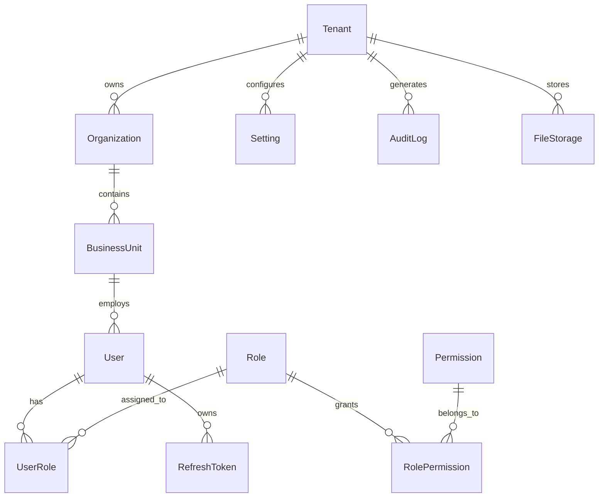

# CORE_ERD.md

> **Projeto:** FleetOS – Enterprise Fleet Management Platform
> **Versão:** 1.0.0 (MVP)
> **Domínio:** Core Platform
> **Status:** Arquitetura Oficial

---

# 1. Objetivo

O Core é o coração do FleetOS.

Todos os demais módulos dependem dele.

Este documento define:

* Estrutura organizacional da plataforma
* Identidade dos usuários
* Controle de acesso
* Configurações
* Auditoria
* Arquivos
* Contexto Multi-Tenant

Nenhum módulo poderá existir sem utilizar este domínio.

---

# 2. Bounded Context

```text
Core Platform
```

Responsável por:

* Tenant
* Empresa
* Filial
* Usuários
* Papéis
* Permissões
* Configurações
* Auditoria
* Arquivos

Não possui regras relacionadas à frota.

Não possui regras financeiras.

Não conhece viagens.

---

# 3. Aggregates

## Aggregate 01

```text
Tenant
```

Responsável por:

* Organização
* Configurações globais

---

## Aggregate 02

```text
Organization
```

Responsável por:

* Business Units

---

## Aggregate 03

```text
User
```

Responsável por:

* Papéis
* Sessões
* Tokens

---

## Aggregate 04

```text
Role
```

Responsável por:

* Permissões

---

## Aggregate 05

```text
Setting
```

Responsável por:

Configurações da plataforma.

---

# 4. Entidades

| Código  | Entidade       |
| ------- | -------------- |
| TEN-001 | Tenant         |
| ORG-001 | Organization   |
| BUS-001 | BusinessUnit   |
| USR-001 | User           |
| ROL-001 | Role           |
| PER-001 | Permission     |
| URO-001 | UserRole       |
| RPE-001 | RolePermission |
| TOK-001 | RefreshToken   |
| SET-001 | Setting        |
| FIL-001 | FileStorage    |
| AUD-001 | AuditLog       |

---

# 5. Value Objects

Os seguintes conceitos deverão ser modelados como Value Objects:

* Email
* Phone
* Address
* CNPJ
* CPF
* PersonName
* FilePath
* FileHash
* Money
* TimeZone
* Language

Todos devem ser imutáveis.

---

# 6. Diagrama Geral



---

# 7. Relacionamentos

## Tenant → Organization

Relacionamento:

1:N

Uma empresa SaaS pode possuir várias organizações.

Uma organização pertence a exatamente um Tenant.

---

## Organization → BusinessUnit

Relacionamento:

1:N

Uma empresa pode possuir diversas filiais.

Cada filial pertence a uma única empresa.

---

## BusinessUnit → User

Relacionamento:

1:N

Usuários pertencem operacionalmente a uma filial.

---

## User → Role

Relacionamento:

N:N

Implementado através de:

UserRole

---

## Role → Permission

Relacionamento:

N:N

Implementado através de:

RolePermission

---

## User → RefreshToken

Relacionamento:

1:N

Um usuário pode possuir várias sessões simultâneas.

---

## Tenant → Setting

Relacionamento:

1:N

Permite configurações específicas para cada cliente.

---

## Tenant → AuditLog

Relacionamento:

1:N

Todos os eventos relevantes serão registrados.

---

## Tenant → FileStorage

Relacionamento:

1:N

Representa apenas metadados.

Arquivos permanecerão no Supabase Storage.

---

# 8. Aggregate Roots

```
Tenant
│
├── Organization
│
└── Setting
```

```
Organization
│
└── BusinessUnit
```

```
User
│
├── RefreshToken
│
└── UserRole
```

```
Role
│
└── RolePermission
```

Cada Aggregate Root controla a consistência de suas entidades filhas.

Nenhuma entidade externa poderá modificar diretamente entidades internas do Aggregate.

---

# 9. Eventos de Domínio

## Tenant

Eventos:

* TenantCreated
* TenantActivated
* TenantSuspended
* TenantUpdated

---

## Organization

Eventos:

* OrganizationCreated
* OrganizationUpdated

---

## BusinessUnit

Eventos:

* BusinessUnitCreated
* BusinessUnitDisabled

---

## User

Eventos:

* UserCreated
* UserActivated
* UserBlocked
* UserPasswordChanged

---

## Role

Eventos:

* RoleCreated
* PermissionGranted
* PermissionRevoked

---

## FileStorage

Eventos:

* FileUploaded
* FileDeleted

---

# 10. Regras de Negócio

## Tenant

* Deve possuir pelo menos uma Organization.
* Não pode ser removido se possuir dados operacionais.
* Pode ser suspenso.

---

## Organization

* Deve pertencer a um Tenant.
* Deve possuir pelo menos uma BusinessUnit.

---

## BusinessUnit

* Não pode existir sem Organization.
* Não pode ser removida se possuir operações.

---

## User

* Email deve ser único dentro do Tenant.
* Senha nunca será armazenada em texto.
* Pode possuir múltiplos papéis.

---

## Role

* Nome único por Tenant.
* Não pode ser removida se utilizada.

---

## Permission

* Somente leitura.
* Criadas por migration.
* Nunca alteradas em produção.

---

# 11. Auditoria

Todas as entidades deverão herdar:

```text
Id
TenantId
OrganizationId
BusinessUnitId

CreatedAt
CreatedBy

UpdatedAt
UpdatedBy

DeletedAt
DeletedBy

RowVersion
```

---

# 12. Implementação EF Core

Cada entidade possuirá:

* Entity
* Configuration
* Repository
* Migration

Exemplo:

```text
User/

User.cs

UserConfiguration.cs

UserRepository.cs
```

---

# 13. Segurança

Toda consulta deverá obrigatoriamente filtrar:

* TenantId

Sempre que aplicável:

* OrganizationId
* BusinessUnitId

Global Query Filters serão obrigatórios.

---

# 14. Decisões Arquiteturais (ADR)

## ADR-001

Utilizar UUID como chave primária.

Motivo:

Evita colisões.

Facilita sincronização futura.

---

## ADR-002

Shared Database.

Shared Schema.

Isolamento lógico.

---

## ADR-003

Soft Delete obrigatório.

---

## ADR-004

Auditoria obrigatória em todas as entidades.

---

## ADR-005

Permissões baseadas em papéis (RBAC).

---

# 15. Dependências

O domínio Core não depende de nenhum outro domínio.

Todos os demais domínios dependem dele.

```text
Fleet

↓

Operations

↓

Inventory

↓

Finance

↓

Dashboard
```

---

# 16. Checklist de Implementação

## Tenant

* [ ] Entidade
* [ ] Configuration
* [ ] Migration
* [ ] Repository
* [ ] DTOs
* [ ] Validators
* [ ] Commands
* [ ] Queries
* [ ] API
* [ ] Testes

## Organization

* [ ] Entidade
* [ ] Configuration
* [ ] Migration
* [ ] Repository
* [ ] DTOs
* [ ] Validators
* [ ] Commands
* [ ] Queries
* [ ] API
* [ ] Testes

## BusinessUnit

* [ ] Entidade
* [ ] Configuration
* [ ] Migration
* [ ] Repository
* [ ] DTOs
* [ ] Validators
* [ ] Commands
* [ ] Queries
* [ ] API
* [ ] Testes

## User

* [ ] Entidade
* [ ] Configuration
* [ ] Migration
* [ ] Repository
* [ ] DTOs
* [ ] Validators
* [ ] Commands
* [ ] Queries
* [ ] API
* [ ] Testes

## Role e Permission

* [ ] Entidades
* [ ] Configuration
* [ ] Seeds
* [ ] Repository
* [ ] DTOs
* [ ] Validators
* [ ] Commands
* [ ] Queries
* [ ] API
* [ ] Testes

---

# 17. Princípio Final

O domínio Core representa a fundação do FleetOS.

Todas as funcionalidades da plataforma devem operar dentro do contexto definido por Tenant, Organization e BusinessUnit, respeitando os Aggregates, as regras de negócio e os limites dos Bounded Contexts.

Nenhuma implementação poderá violar esses limites ou criar dependências diretas entre domínios distintos.
