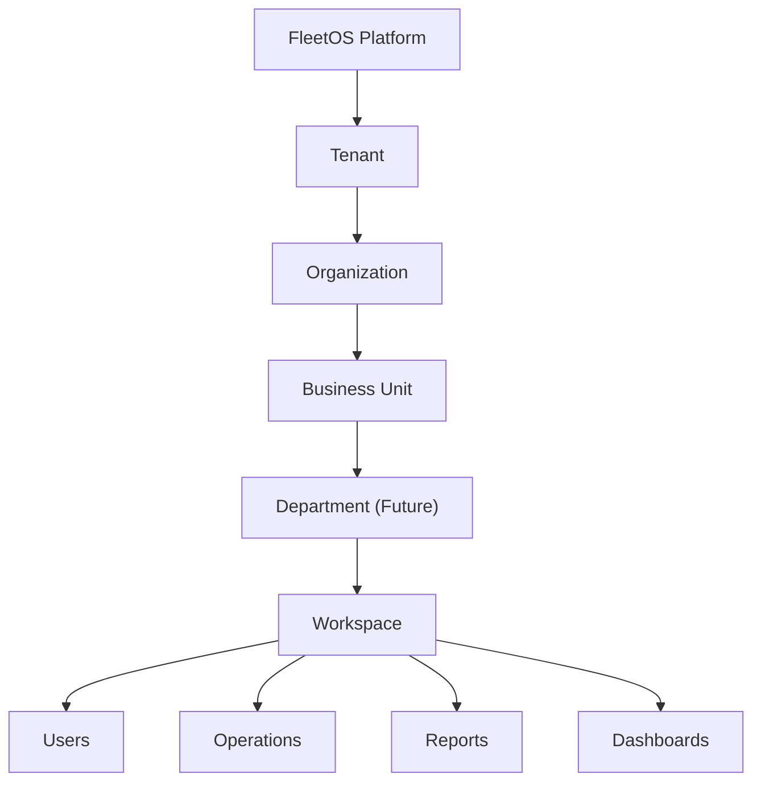
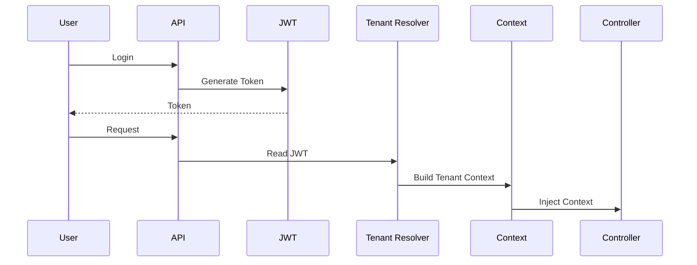

# TENANT_MODEL.md

> **Projeto:** FleetOS - Enterprise Fleet Management Platform
> **Versão:** 2.0.0
> **Status:** Arquitetura Oficial
> **Documento Obrigatório**

---

# 1. Objetivo

Este documento define a arquitetura Multi-Tenant oficial do FleetOS.

Ele estabelece como clientes, empresas, filiais, usuários e recursos serão isolados dentro da plataforma.

Toda implementação relacionada à persistência, autenticação, autorização, cache, storage e auditoria deverá respeitar este documento.

---

# 2. Filosofia

O FleetOS é uma plataforma SaaS.

A plataforma pertence ao FleetOS.

Os dados pertencem ao Tenant.

Cada Tenant deve sentir que possui sua própria instalação do sistema.

Embora todos compartilhem a mesma infraestrutura física, nenhum Tenant poderá visualizar ou acessar recursos pertencentes a outro.

---

# 3. Arquitetura Organizacional



---

# 4. Camadas Organizacionais

## Platform

Representa o software FleetOS.

Responsável por:

* Billing
* Marketplace
* Feature Flags Globais
* Licenciamento
* Administração Global
* Observabilidade
* Monitoramento
* Health Checks

Nunca contém regras específicas de clientes.

---

## Tenant

Representa um cliente SaaS.

Possui:

* Assinatura
* Plano
* Configurações
* Branding
* Idioma
* Timezone
* Recursos habilitados
* Empresas

Cada Tenant possui isolamento completo.

---

## Organization

Representa uma pessoa jurídica.

Exemplo:

Baby Turismo LTDA

Transportes Silva LTDA

Empresa XPTO

Uma Organization pode possuir várias unidades operacionais.

---

## Business Unit

Representa uma filial.

Possui:

* Frota
* Estoque
* Financeiro
* Usuários
* Agenda

As Business Units compartilham a mesma Organization, porém possuem autonomia operacional.

---

## Department (Roadmap)

Permite dividir uma unidade em departamentos.

Exemplo:

Operações

Financeiro

RH

Comercial

Manutenção

---

## Workspace

Workspace representa um espaço funcional.

Cada Workspace possui:

* Dashboards
* Configurações
* Favoritos
* Layout
* Widgets
* Relatórios

Esse conceito permite evolução futura sem alterar o domínio.

---

# 5. Modelo Multi-Tenant

A plataforma utilizará:

Shared Database

Shared Schema

Isolamento lógico.

Toda tabela conterá obrigatoriamente:

TenantId

OrganizationId

BusinessUnitId

Esses três identificadores formam o contexto organizacional.

---

# 6. Contexto Organizacional

Todo request possui um contexto.

```text
Tenant

↓

Organization

↓

Business Unit

↓

Workspace

↓

User
```

Nenhuma operação pode existir fora desse contexto.

---

# 7. Resolução do Tenant

Na primeira versão:

JWT

No futuro:

Subdomínio

Domínio personalizado

API Key

SSO

Fluxo:



Controllers nunca consultam diretamente qual Tenant está autenticado.

---

# 8. Tenant Context

Toda requisição recebe automaticamente:

TenantId

OrganizationId

BusinessUnitId

WorkspaceId

UserId

CorrelationId

RequestId

Timezone

Language

Essas informações ficam disponíveis durante toda a execução da requisição.

---

# 9. Isolamento de Dados

Nenhuma consulta poderá ignorar o Tenant.

Exemplo incorreto:

```sql
SELECT * FROM Drivers;
```

Exemplo correto:

```sql
SELECT *

FROM Drivers

WHERE TenantId=@TenantId

AND OrganizationId=@OrganizationId;
```

No Entity Framework será utilizado Global Query Filter.

---

# 10. Estrutura de Storage

Cada Tenant possuirá estrutura própria.

```text
storage/

tenant-001/

organization-001/

business-unit-001/

drivers/

vehicles/

documents/

fuel/

maintenance/

reports/
```

Nunca misturar arquivos entre Tenants.

---

# 11. Estrutura do Cache

Redis utilizará namespaces.

Exemplo:

```text
tenant:15:dashboard

tenant:15:vehicles

tenant:15:drivers

tenant:15:reports

tenant:15:fuel
```

Todo cache será invalidado por Tenant.

---

# 12. Configurações

As configurações serão herdadas.

Hierarquia:

```text
Platform

↓

Tenant

↓

Organization

↓

Business Unit

↓

Workspace

↓

User
```

Cada camada poderá sobrescrever configurações da camada superior.

---

# 13. Branding

Cada Tenant poderá personalizar:

Logo

Nome

Tema

Cores

Ícones

Domínio

Login

E-mails

Relatórios

Essa estrutura permitirá White Label futuramente.

---

# 14. Feature Flags

As funcionalidades poderão ser habilitadas em diferentes níveis:

Platform

↓

Plan

↓

Tenant

↓

Organization

↓

Business Unit

↓

Workspace

↓

User

Isso permite grande flexibilidade comercial.

---

# 15. Segurança

Toda operação será validada utilizando:

Tenant

Organization

Business Unit

Workspace

User

Permission

Não basta possuir permissão.

O recurso deve pertencer ao mesmo contexto organizacional.

---

# 16. Auditoria

Toda auditoria registrará:

TenantId

OrganizationId

BusinessUnitId

WorkspaceId

UserId

SessionId

CorrelationId

IP

Browser

Timestamp

Operation

Entity

OldValue

NewValue

---

# 17. Observabilidade

Toda telemetria será segmentada por Tenant.

Exemplos:

Tempo médio de resposta

Uso de CPU

Uso de memória

Quantidade de usuários

Consumo de Storage

Consumo de API

Esses dados alimentarão dashboards administrativos da plataforma.

---

# 18. Escalabilidade

A arquitetura deve suportar:

Milhares de Tenants

Milhões de usuários

Bilhões de registros

Centenas de filiais por empresa

Sem necessidade de alteração estrutural.

---

# 19. Limites de Responsabilidade

## Platform

Responsável por serviços compartilhados.

Nunca manipula regras de negócio de um cliente.

---

## Tenant

Responsável pelo ambiente do cliente.

Nunca conhece outros Tenants.

---

## Organization

Responsável pela gestão empresarial.

---

## Business Unit

Responsável pela operação local.

---

## Workspace

Responsável pela experiência do usuário.

---

# 20. Roadmap Evolutivo

A arquitetura foi desenhada para suportar futuramente:

* Multi-região
* Multi-cloud
* Multi-idioma
* Multi-moeda
* White Label
* Marketplace
* API Pública
* SSO (SAML/OIDC)
* Provisionamento automático
* IA personalizada por Tenant
* Analytics avançado

Sem mudanças estruturais no domínio.

---

# 21. Princípio Final

O Tenant é o principal limite de isolamento da plataforma.

Nenhum componente, módulo, serviço, consulta, evento ou recurso poderá violar esse limite.

Toda decisão arquitetural futura deverá preservar o isolamento entre Tenants, garantir segurança dos dados e permitir que a plataforma cresça para milhares de clientes mantendo previsibilidade, desempenho e simplicidade operacional.
